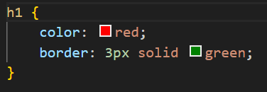

<!-- START doctoc generated TOC please keep comment here to allow auto update -->
<!-- DON'T EDIT THIS SECTION, INSTEAD RE-RUN doctoc TO UPDATE -->
**Table of Contents**

- [CSS](#css)
  - [CSS Syntax](#css-syntax)
  - [CSS selectors](#css-selectors)
    - [CSS element selector](#css-element-selector)
    - [CSS id selector (#)](#css-id-selector-)
    - [CSS class selector (.)](#css-class-selector-)
    - [Universal selector](#universal-selector)
    - [The CSS grouping selector](#the-css-grouping-selector)

<!-- END doctoc generated TOC please keep comment here to allow auto update -->

# CSS
CSS is the language used to style an HTML document.  
CSS stands for Cascading Style Sheets.  
CSS was created by the World Wide Web Consortium (W3C).  
CSS is used to define styles for your web pages including the design, layout, and variations in display for different devices and screen sizes.  

## CSS Syntax
A CSS rule consists of a selector and a declaration block.  


```h1``` is the selector.  
The declaration block is from the opening curly brace to the closing curly brace.  
```color: red``` is a declaration.   
```border: 3px solid red``` is a declaration.  
```color``` is a property.  
```red``` is a value.
```border``` is a property.  
```3px solid red``` is a value.  

```Selector```: points to the html element that you want to style.  
```declaration block```: contains one or more declarations separated by a semi-colon. It defines the styles that the element(s) is going to have.  
Each declaration includes a CSS property name and a value, separated by a semi-colon.  

## CSS selectors
A css selector selects HTML element(s) that you want to style.  
CSS selectors can be divided into 5 categories:  
- **Simple selectors** - select elements based on name, id and class.  
- **Combinator selectors** - select elements based on the relationship between them.
- **pseudo-class selectors** - select elements based on a certain state.  
- **attribute selectors** - select elements based on an attribute or attribute value.  

### CSS element selector
Selects an element based on the element name.  
```html
<p>Hello, world </p>
<p>How do you do, world</p>
```
```css
p {
    border: 3px solid red;
}
```

### CSS id selector (#)
Uses the id attribute of an element to select a specific element.  
Elements cannot share id, and id is only specific to one element.  
To select an element based on the id, we write the hash (#) character, followed by the id of the element that we want to select.  
```html
<h3 id="title1">Hello, world</h3>
```
```css
#title1 {
    color: crimson;
}
```

### CSS class selector (.)
Selects HTML elements with a specific class attribute.  
To select elements with a specific class, write a period (.) character, followed by the class name.  
```html
<h4 class="title4">why learn CSS</h4>
<h4 class="title4">advantages of CSS</h4>
```
```css
.title4 {
    text-align: center;
}
```
HTML elements can have more than 1 class
```html
<p class="red large center">CSS is fun</p>
```
```css
.red {
    color: red;
}

.large {
    font-size: 48px;
}

.center {
    text-align: center;
}
```

### Universal selector
The css universal selector selects all html elements.
```html
<h1>CSS</h1>
<h2 class="sub-title">Why Learn CSS</h2>
<p>To style HTML pages</p>
<p>Make pages responsive to all devices</p>
```
```css
*{
    text-align: center;
    color: black;
}
```

### The CSS grouping selector
The CSS grouping selector selects all the HTML elements with the same style definitions.  
In the code below, h1, h2 and p have same style definitions.  
```css
h1 {
    color: red;
    border: 2px solid green;
}

h2 {
    color: red;
    border: 2px solid green;
}

p {
    color: red;
    border: 3px solid green;
}
```

It would be better to group these selectors to minimize the code, to group these selectors, separate each selector with a comma.  
```css
h1, h2, p {
    color: red;
    border: 3px solid red;
}
```